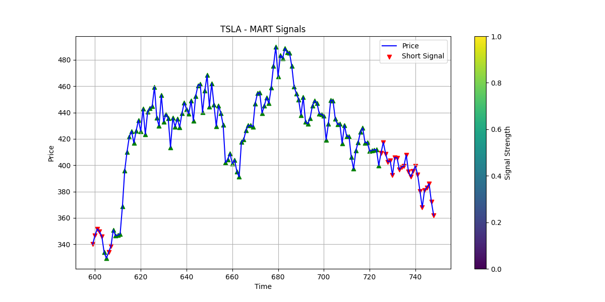

# Moving Average Randomized Trees (MART)




A Python imblementation **Moving Average Randomized Trees (MART)** an ensemble of  trees whose split criteria are driven by randomized exponential moving averages for financial time series forecasting.

This is only tree implementaion the ensemble can be implemented using any ensemble method like bagging or boosting. The key innovation is the use of multiple EMA spans directly in the tree‐split criteria, allowing the model to capture temporal dependencies without relying on high‐dimensional lag features. This approach is robust against whipsaw and fixed‐window limitations of classic MA crossover rules, making it well‐suited for financial forecasting tasks. The Cython‐accelerated MACD computations ensure fast training and inference.

## Features

- Integrates multiple EMA spans directly into tree‐split criteria  
- Preserves temporal dependencies without high‐dimensional lag features  
- Robust against whipsaw and fixed‐window limitations of classic MA crossover rules  
- Fast training and inference (Cython‐accelerated MACD computations)  
- Backtested on 19 diverse financial instruments  

## Installation

1. Clone the repository:
   ```bash
   git clone https://github.com/yuvrajiro/mart.git
   cd mart
    ```

2. Create a virtual environment and install dependencies:

   ```bash
   python3 -m venv venv
   source venv/bin/activate
   pip install -r requirements.txt
   ```

3. **Compile the Cython MACD module**:

   ```bash
   python setup.py build_ext --inplace
   ```


## License

This project is licensed under the MIT License.

## Contributing

Contributions, bug reports, and feature requests are welcome! Please open an issue or submit a pull request on GitHub.

## Paper

The paper will be available soon. Stay tuned!

Bibliography (Placeholder for now)

```{bibtex}


```